<div align="center">

# Atlas-Assistant

**Tu asistente personal. En tu ordenador. Sin depender de la nube de nadie.**

Habla contigo por voz, atiende tu WhatsApp — mensajes **y llamadas de teléfono** —,
controla tu ordenador, programa lo que necesites y recuerda lo que importa.

<br>

## [](../../releases/latest)

**No hace falta saber programar. Se descomprime y se abre.**

<br>

[](../../releases/latest)
[-0078d4)](../../releases/latest)

[Instalación](#instalación) · [Qué sabe hacer](#qué-sabe-hacer) · [Qué se siente](#diseñada-para-que-no-tengas-que-ir-a-buscarla)

</div>

<p align="center">
  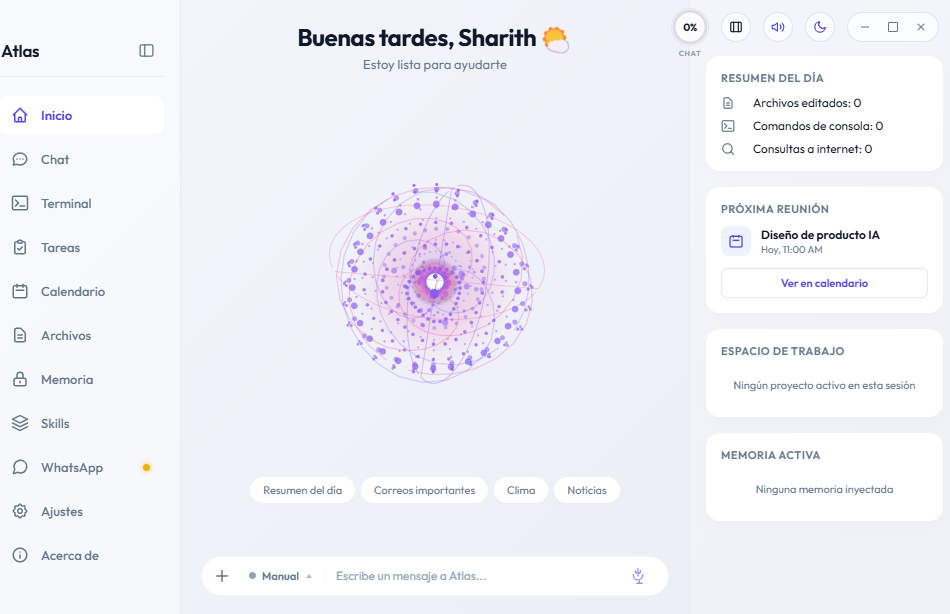
</p>

---

## Por qué ATLAS

Casi todos los asistentes son una caja de texto en una web. Tú escribes, ellos contestan, y ahí se acaba.

ATLAS no. **Vive en tu ordenador**, tiene tus archivos delante, tu WhatsApp conectado y memoria de lo que habéis hablado. Le hablas y te responde con voz. Le pides algo y lo hace — no te explica cómo hacerlo.

Y cuando no estás en casa, sigue trabajando: **le escribes por WhatsApp desde el móvil y te devuelve el trabajo hecho.**

---

## En el día a día

- Estás en una reunión y te llaman por WhatsApp. ATLAS contesta, atiende la
  llamada, y te deja el resumen listo para cuando salgas.
- Necesitas un informe antes de una cita y no vas a pasar por el escritorio.
  Se lo pides por WhatsApp desde el móvil; al volver, el archivo ya está.
- Le señalas un fallo en un script. Lo localiza, lo corrige, y te explica qué
  cambió y por qué.

## Lo que la hace distinta

### Contesta el teléfono

No es un bot que escribe mensajes. Cuando alguien te llama por WhatsApp, ATLAS **descuelga y conversa** en voz alta, en tiempo real. Toma el recado, te lo pasa al momento, y si hace falta te pregunta a ti en mitad de la llamada sin que el otro se entere.

<!-- IMAGEN: vídeo de una llamada entrante y Atlas contestando
     Sube el fichero a `docs/img/llamada.gif` y quita este comentario
     (las dos lineas de <!-- y -->) para que se vea. -->
<!--
<p align="center">
  
</p>
-->

### La manejas desde el móvil

Estás fuera y necesitas un informe, un archivo o que revise algo en tu ordenador. Le escribes por WhatsApp como a cualquier persona, y ATLAS lo hace en tu PC y te devuelve el resultado. Sin escritorio remoto, sin sentarte delante.

### Un modelo para cada tarea, no uno caro para todo

ATLAS reparte el trabajo entre varios modelos según lo que cueste cada cosa. El modelo caro y potente solo entra cuando toca programar o manejar el sistema; charlar, buscar o contestar un WhatsApp va con uno rápido y barato.

| Rol | Para qué |
|---|---|
| `conversational` | Hablar contigo |
| `os_agent` | Programar y manejar tu ordenador |
| `navigate` | Moverse por la web |
| `fast_search` | Buscar en internet |
| `memory_cortex` | Decidir qué recordar |
| `whatsapp_contacts` | Chats y llamadas |

Cada uno se cambia desde Ajustes, sin tocar código — incluido el catálogo
completo de NVIDIA NIM si añades su clave. **No pagas modelo de programador
para decir "buenos días".**

<p align="center">
  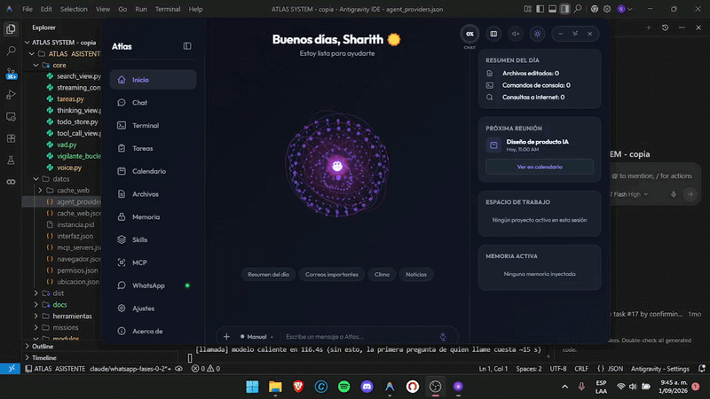
</p>

### Recuerda de verdad

Dos memorias, como una persona:

- **Corto plazo** — el hilo de la conversación de ahora.
- **Largo plazo** — una bóveda que crece sola. Lo que aprende contigo se consolida en notas enlazadas, y un córtex decide en cada turno qué merece recordar. No relee todo: trae solo lo que hace falta.

Todo en tu disco. Nada sube a ningún servidor.

<p align="center">
  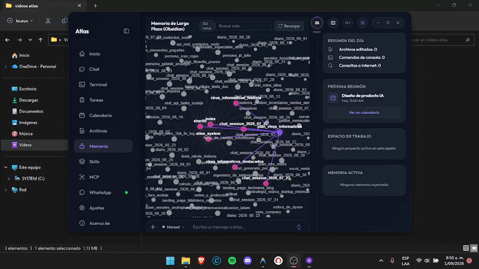
</p>
<p align="center">
  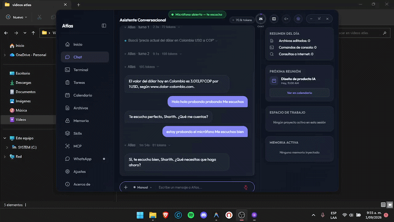
</p>

---

## Qué sabe hacer

### Voz en tiempo real

Le hablas y te contesta hablando, sin tocar el teclado. Detecta cuándo empiezas y cuándo terminas de hablar, y puedes interrumpirla a media frase.

Su voz es tuya: **eliges cuál** entre decenas en español, y ajustas velocidad y tono. También cuánto silencio espera antes de dar tu turno por terminado.

<p align="center">
  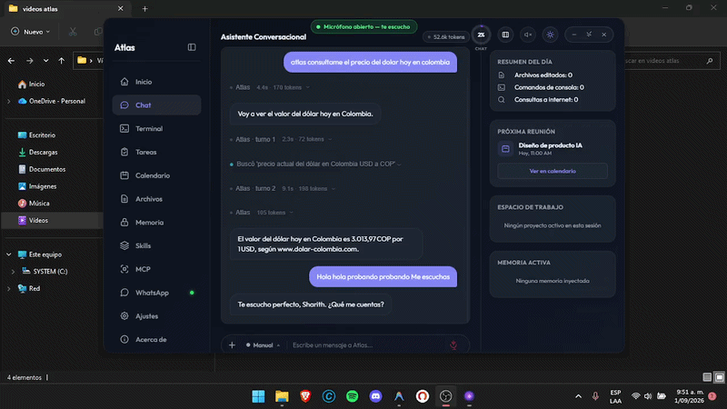
</p>

### WhatsApp completo

- Lee y contesta tus chats, con el carácter que tú le pongas
- **Atiende las llamadas** y conversa por teléfono
- Te avisa cuando alguien te busca de verdad, y se calla cuando no hace falta
- Sabe cuándo apartarse: si estás tú escribiendo en ese chat, no se mete
- Devuelve las llamadas perdidas

<p align="center">
  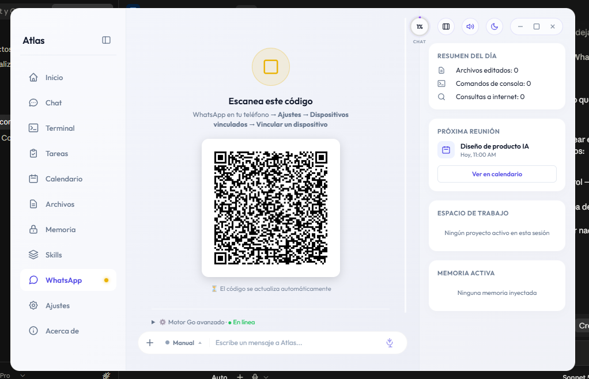
</p>

### Maneja tu ordenador

Crea y edita archivos, ejecuta comandos, instala cosas, programa lo que le pidas. Le dices qué quieres conseguir; ella decide los pasos y los va dando, corrigiéndose si algo falla.

<p align="center">
  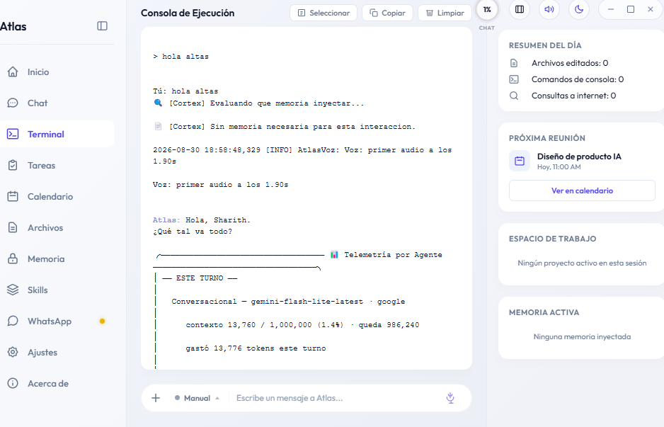
  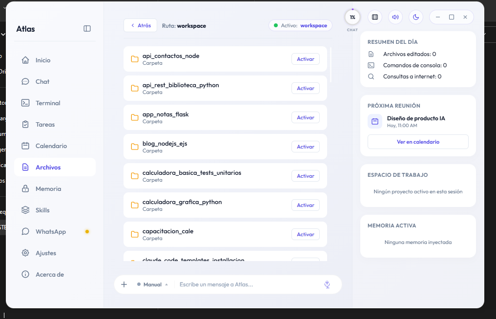
  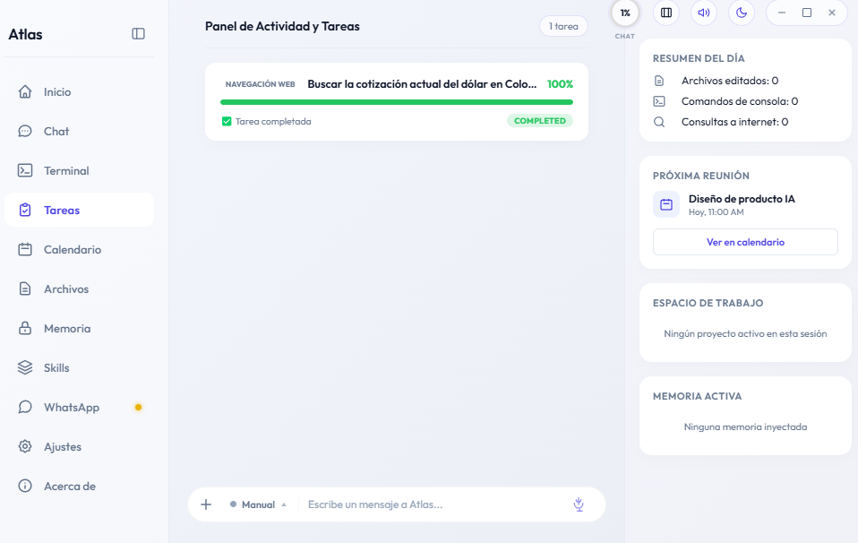
</p>

### Navega la web

Abre un navegador de verdad, busca, entra en las páginas y saca lo que necesitas. No se inventa datos: los va a buscar.

<p align="center">
  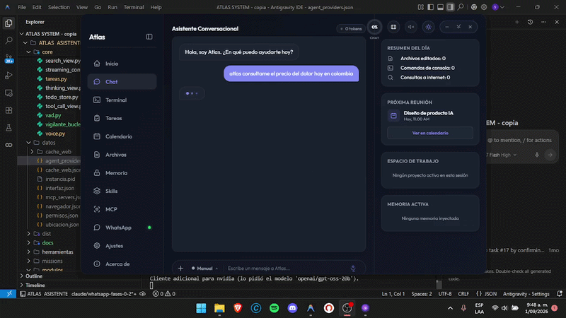
</p>

### Documentos

Lee y crea Word, Excel, PowerPoint y PDF. Arrastra un archivo a la ventana y lo entiende — también fotos y documentos escaneados.

### Habilidades ampliables

ATLAS aprende cosas nuevas sin recompilar nada. Las **skills** son instrucciones especializadas que se instalan y quedan disponibles al instante. Le dices que instale una y ella la descarga, la ordena y la registra sola.

<p align="center">
  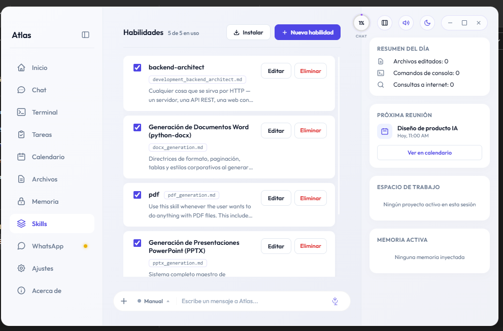
</p>

---

## Instalación

<div align="center">

[](../../releases/latest)

</div>

**No necesitas Python ni instalar dependencias.** Es un programa, se descomprime y se abre.

1. Descarga **`Atlas-v1.0.0-windows.zip`** desde [releases](../../releases/latest) y descomprímelo donde quieras.
2. Abre el archivo **`.env`** con el Bloc de notas y pon tus claves (lee abajo qué es esto si nunca lo has hecho).
3. Ejecuta **`Atlas.exe`**.

### ¿Qué es una "API" y por qué necesito una "clave"? (léelo si es la primera vez)

No hace falta saber programar para entender esto — solo la idea, con un ejemplo:

Imagina un restaurante. Tú no entras a la cocina a cocinar tu plato: se lo pides
a un **mesero**, el mesero se lo dice al cocinero, y te trae el plato ya listo.
Una **API** es exactamente eso — **la forma en que un programa le pide algo a
otro programa, por internet.**

ATLAS no "piensa", ni "escucha", ni "habla" por sí sola: esas partes las hacen
**Google, DeepSeek y NVIDIA** — empresas a las que en este mundo se les llama
**"proveedores de IA"**, porque cada una es dueña de su propia inteligencia
artificial y la ofrece por internet, como cada restaurante tiene su propia
cocina y su propio menú. ATLAS no cocina nada: solo hace de mesero entre tú y
esas cocinas — les lleva tu pregunta al restaurante que sepa responderla mejor,
y te trae el plato ya hecho.

Por eso hay más de una clave: cada "restaurante" (proveedor) te pide la suya,
igual que cada restaurante de verdad te da su propia tarjeta de puntos — no
sirve la de uno en el otro.

Para que esas empresas sepan que quien pide el plato eres **tú** (y no
cualquier otra persona), te piden una **clave** — una fila larga de letras y
números, como una contraseña — que identifica tu cuenta. La sacas tú mismo en
un par de minutos, y **cada persona usa la suya**: no viene ninguna incluida
dentro del programa, porque si viniera una sola, sería la mía, la usaría todo
el mundo que lo descargara, y la bloquearían enseguida por abuso. Con tu
propia clave, lo que uses es tuyo y nadie te lo quita.

**No todos los proveedores cobran igual.** Google es gratis para lo que un
uso normal necesita. DeepSeek es un servicio **de pago** — barato, pero de
pago desde el principio, sin capa gratuita permanente —, así que necesitas
cargarle un pequeño saldo a tu cuenta antes de que la clave funcione. Más
abajo te digo exactamente cuánto y cómo.

En resumen: una **API key** no es "código" ni algo técnico que tengas que
entender por dentro — es tu **usuario y contraseña personal** para que Google
y DeepSeek le den permiso a ATLAS de pensar, hablar y ver por ti.

### Cómo conseguir tu clave de Google (la única imprescindible, ~2 minutos)

**Con esta sola ya arranca y puedes hablar con ella.** Es la única de las
cuatro sin la que ATLAS no puede "pensar" — las demás cada una desbloquea
algo puntual, esta es la base.

1. Entra a **https://aistudio.google.com/apikey** e inicia sesión con tu cuenta de Gmail (la misma de siempre).
2. Busca el botón para crear una clave nueva (dice algo como **"Create API key"** o **"Crear clave de API"**) y púlsalo.
3. Aparece una fila larga de letras y números — es tu clave. Cópiala (el icono de copiar suele estar al lado).
4. Abre el archivo **`.env`** de ATLAS con el Bloc de notas, busca la línea `GOOGLE_API_KEY=` y pega tu clave justo después del signo `=`, sin espacios ni comillas.

**Ojo con un matiz:** tal cual, sin nada más, la clave ya es gratis y ya
funciona — pero Google la deja **limitada**: menos peticiones por minuto y sin
acceso a sus modelos más potentes. Para el catálogo completo hay que activar
la facturación de Google Cloud (agregar una tarjeta, la "cartera") — pero eso
**cambia las reglas**: en el momento en que la activas, dejas la capa gratuita
y pasas a pagar por lo que uses, ya no es "gratis con un candado de más".
Para empezar y para el día a día no hace falta — la capa gratuita alcanza de
sobra —, actívala solo si de verdad necesitas los modelos más potentes de
Google y estás dispuesto a que te cobren por usarlos.

### Cómo conseguir tu clave de DeepSeek (para el Agente que programa y maneja tu PC — **de pago**)

**Esta sí cuesta dinero**, a diferencia de la de Google. No es un truco ni una
suscripción escondida: DeepSeek no tiene capa gratuita permanente, así que
para que la clave funcione necesitas cargar saldo en tu cuenta, como una
tarjeta prepago. Es barata de verdad para lo que se usa — solo entra en juego
cuando le pides a ATLAS que programe algo o maneje tu ordenador (ver la tabla
de arriba), no en cada mensaje —, pero sí es de pago desde el primer uso.

1. Entra a **https://platform.deepseek.com**, crea una cuenta (con correo o Google) e inicia sesión.
2. Busca la sección de **saldo/facturación** (algo como **"Billing"** o **"Top up"**) y carga un monto pequeño — con 2 o 5 dólares alcanza para empezar.
3. Ve a la sección **"API keys"** y pulsa el botón para crear una nueva (algo como **"Create new key"**).
4. Cópiala apenas te la muestre — **algunas plataformas solo la enseñan una vez**, así que si la cierras sin copiarla tendrás que crear otra.
5. Pégala en el `.env`, después de `DEEPSEEK_API_KEY=`.

**Si no quieres pagar todavía, no pasa nada:** deja esa línea vacía. ATLAS
arranca igual y conversa contigo con la clave de Google — solo se queda sin
el Agente que toca tu ordenador hasta que la agregues.

Las otras dos son **opcionales** — ATLAS funciona sin ellas, solo desbloquean
cosas extra:

- `BRAVE_API_KEY` — búsqueda web más rápida — https://brave.com/search/api
- `NVIDIA_API_KEY` — desbloquea el catálogo NIM (más de cien modelos) para
  asignar el que prefieras a cada rol — https://build.nvidia.com

Pon también tu `USER_NAME` (una línea más arriba en el `.env`) para que ATLAS sepa cómo llamarte.

**Las claves son tuyas.** ATLAS no incluye ninguna ni las comparte con nadie — se quedan en tu `.env`, en tu propio ordenador.

### Al abrirlo, Windows te avisará

Verás **"Windows protegió tu PC"**. Es porque el programa no lleva un certificado de firma comprado, no porque tenga nada malo. Pulsa *Más información → Ejecutar de todas formas*.

Tu antivirus puede quejarse por lo mismo. Si te lo bloquea, añade la carpeta a las excepciones.

### Requisitos

Windows 10 o superior (64 bits) · ~3 GB de disco · conexión a internet · micrófono para hablarle

---

## Diseñada para que no tengas que ir a buscarla

La mayoría de los asistentes esperan a que tú los abras: escribes, esperas,
lees. ATLAS funciona al revés — trabaja en segundo plano y solo aparece cuando
de verdad tiene algo que resolver o que contarte.

<p align="center">
  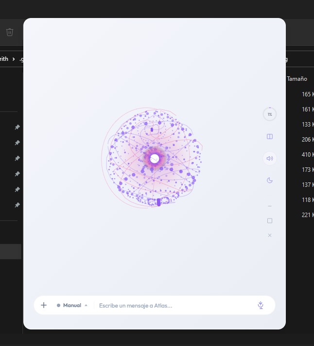
</p>

- **Contesta con voz, en el momento**, y se la puede interrumpir a media frase.
- **Filtra lo que te llega.** Resuelve sola lo rutinario y solo te avisa de lo
  que de verdad importa.
- **Ejecuta tareas completas sin supervisión.** Decide los pasos, los sigue, y
  se corrige si algo sale mal por el camino.
- **Construye memoria entre sesiones**, así que no hay que repetirle el
  contexto cada vez que se abre.
- **Sigue disponible cuando tú no estás.** Se le escribe desde el móvil y el
  trabajo aparece hecho al volver.

Todo esto corre dentro de tu ordenador, sin depender de un servidor externo.

<details>
<summary><b>Para quien quiera mirar debajo del capó</b></summary>

<br>

ATLAS no es un programa: son varios trabajando juntos, cada uno en lo suyo.

```
Interfaz de escritorio    PyQt6, con la ventana dibujada en HTML/JS
Bucle conversacional      reparte cada turno entre los agentes
Agente de sistema         ejecuta, programa y corrige
Navegador                 Playwright, con su propio buscador
Módulo de WhatsApp        servidor en Go (whatsmeow) + agente propio
Voz                       síntesis en streaming y escucha con detector de voz
Memoria                   bóveda de notas enlazadas + córtex de recuperación
```

### Por dónde pasa cada cosa

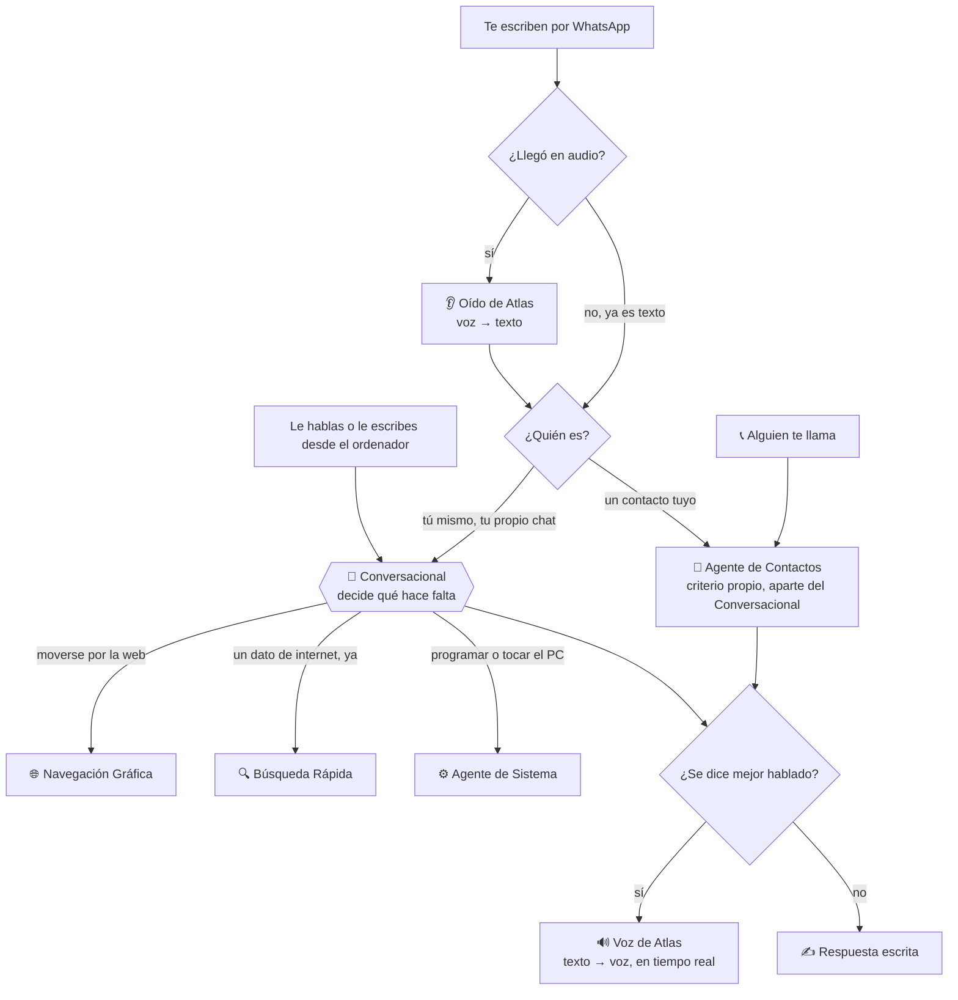

Dos detalles que no se ven a simple vista:

- **El chat "Tú"** (tu propio número, el que usas para hablarle a ella) **no
  es un chat de contacto más**: comparte cerebro y memoria con el
  Conversacional de siempre — el mismo que te atiende por voz o por el chat
  de escritorio.
- **Los chats de tus demás contactos, y las llamadas que recibes, van por un
  Agente de Contactos aparte**, con su propio criterio — no el mismo con el
  que hablas tú. Una llamada y un chat de esa misma persona sí comparten
  ese criterio entre sí.

Lo único que sale de tu ordenador son las peticiones a los modelos de IA, con tus
propias claves.

</details>

---

## Privacidad

Tus conversaciones, tus contactos, tu memoria y tu sesión de WhatsApp **se quedan en tu disco**, en la carpeta del programa. No hay servidor intermedio, no hay cuenta que crear, no hay telemetría.

---

## Estado del proyecto

ATLAS 1.0.0 es la primera versión pública. Funciona y se usa a diario, pero es joven: habrá cosas que fallen.

Si encuentras un error, abre un [issue](../../issues) contando qué hacías, qué esperabas y qué pasó. Si sale un mensaje de error, pégalo.

---

## Quién la hizo

**Sharith Javier Manjarrez Pacheco** — Ingeniero de Sistemas, Colombia.

Especializado en Inteligencia Artificial (machine learning y sistemas de agentes autónomos) y desarrollo backend.

[github.com/sharith45](https://github.com/sharith45) · [](mailto:sharithmanjarrezpacheco@gmail.com)

---

## Licencia

Este programa es **gratis para descargar y usar**. El repositorio distribuye
el ejecutable compilado, no el proyecto completo — el núcleo de ATLAS (la
orquestación de agentes, el navegador, WhatsApp, la memoria) no es público.

Sí quedan visibles, a modo de transparencia, dos partes puntuales:
`prompts/` (las instrucciones que gobiernan cómo decide y se comporta cada
agente) y `herramientas/` (los generadores de Word/Excel/PowerPoint/PDF).
El resto del código sigue siendo privado.

---

<div align="center">

**ATLAS** — Tu asistente. Tu ordenador. Tu información.

</div>
